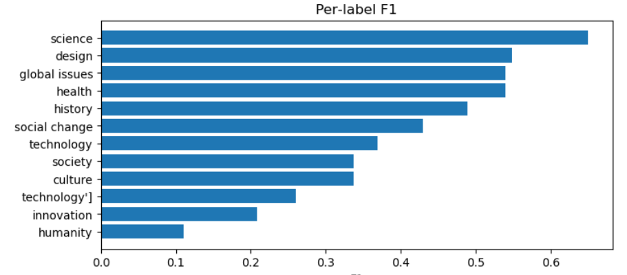
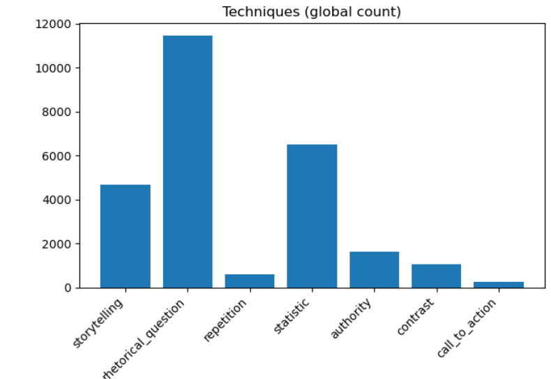
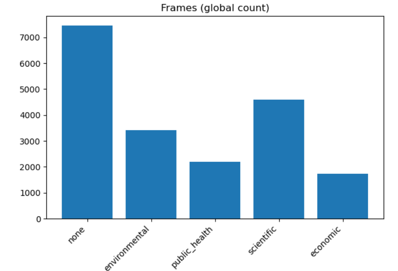
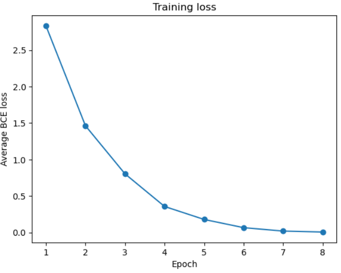
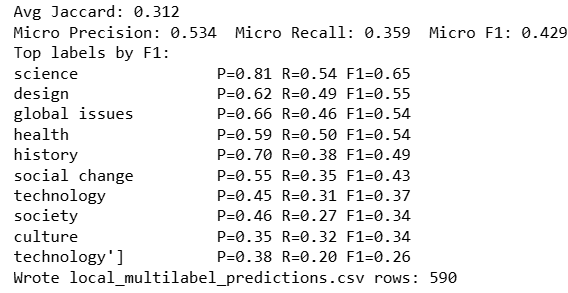
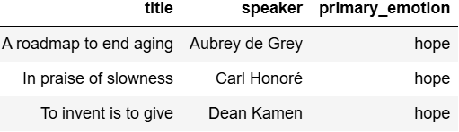
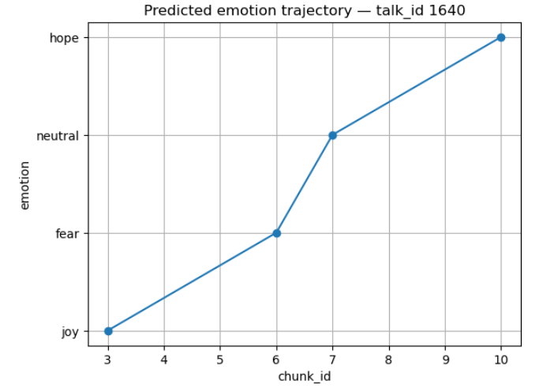
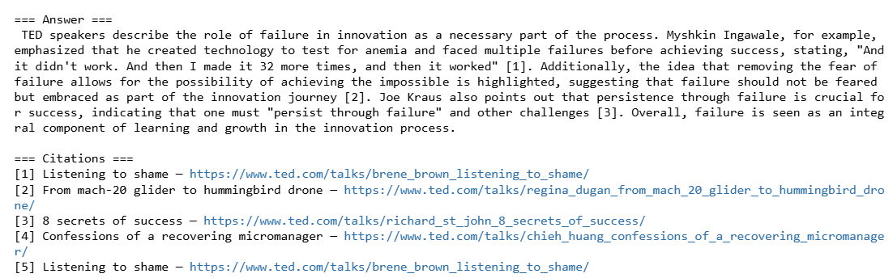

# TED Talks Feature Extraction with LLMs

**One Sentence Summary**  
This repository implements a complete NLP pipeline to extract and analyze semantic features from TED Talks transcripts using Large Language Models (LLMs), combined with clustering and visualization techniques for deeper topic understanding.

---

## Overview

The **goal** of this project is to process TED Talks transcripts to uncover meaningful patterns, themes, and speaker insights using **feature extraction powered by LLM embeddings** and Open AI. I think this is a very useful tool to use when you are busy to watch or listen to TedTalks videos but also do not want to miss out on educational resources or an opportunity to learh about peoples shared stories.

**Challenge:** TED Talks cover a vast range of topics, styles, and vocabularies. Extracting consistent, high-quality semantic features for clustering, search, or recommendation requires robust preprocessing, embedding generation, and model evaluation.

**Approach:**  
- Preprocess the raw TED Talks dataset (clean text, handle missing values, remove noise).  
- Extract semantic embeddings using a state-of-the-art LLM API.  
- Apply clustering to group talks by thematic similarity.  
- Create an embedding search tool for semantic querying.  
- Visualize embeddings in 2D for interpretability.

**Performance:**  
- Successfully built a pipeline that processes 4,000+ TED Talks.  
- Generated high-quality semantic embeddings for each talk.  
- Identified meaningful clusters that align with TED topic categories.  
- Enabled semantic search to retrieve talks relevant to any user query.

---

## Summary of Workdone

### Data

**Source:** [`ted_talks_en.csv`](ted_talks_en.csv)  
**Type:** CSV — Contains TED Talk metadata and transcripts.  
**Size:** ~4,016 talks

**Key columns:**  
- `title` — Talk title  
- `speaker` — Name of the speaker  
- `description` — Short talk description  
- `transcript` — Full text of the talk  
- `tags` — Talk categories  
- `views` — Number of views on TED.com  

---


#### Preprocessing / Clean up

Steps performed in `data_cleaning.ipynb` and `data_preproccessing.ipynb`:
- Removed rows with missing or duplicate transcripts.  
- Lowercased and stripped unwanted characters.  
- Removed excessive whitespace.  
- Tokenized and lemmatized text.  
- Removed stopwords for certain analyses.  

---

#### Data Visualization

`post_proccessing.ipynb` explored:
**Word frequency plots**: Most common words in TED Talks (excluding stopwords).  
**Talk length distribution**: Most talks range between 1,000–2,000 words.  
**Top tags**: e.g., "technology", "science", "culture".  

---




### Problem Formulation

**Input:** TED Talk transcripts,url etc.  
**Output:** 
*Summary of transcript/ talk
*Main emotion/theme of the conversation
* URLs as citation

**Models:**  
**text-embedding** :small → Converts transcripts into 1,536-dimensional embeddings for clustering, search, and downstream ML tasks.

 Since this is an embedding + clustering task, there’s no traditional “training” with loss functions.  

Pipeline steps:
1. Send transcripts to LLM API for embeddings (`feature_extraction_API.ipynb`).  
2. Store embeddings in vector database for retrieval.  
3. Run K-Means clustering on embeddings `transfer_learning_and_clustering.ipynb`( Used logistic regression).  
4. Visualize with PCA & t-SNE.  


**gpt-4o-mini** : Reads chunks of transcripts and outputs structured JSON (e.g., topics, sentiment, summary)
    -could not use it for fine-tuning due to time and cost management
    
**Multi‑Label Classifier**- SGD training for metrics and loss, visualizations of outputs.



Training: 80/20
-It evaluates the final model using:
-Binary Cross-Entropy Loss (training loss curve)
-Micro Precision, Micro Recall, Micro F1 (overall performance)
-Per-label Precision, Recall, F1 (top-performing TED Talk tags)
-Jaccard similarity (multi-label set overlap)



**Techniques**
 **Embedding Extraction:** LLM API (OpenAI/transformers-based models).  
 **Clustering:** K-Means, silhouette score tuning.  
 **Search:** Cosine similarity for semantic retrieval.  

**Hyperparameters:**  
- Embedding dimension: 1536 (LLM default).  
- Number of clusters: Tuned between 5–15.  
---

### Performance Comparison

- **Clustering quality:** Evaluated with silhouette scores and manual inspection.  
- **Semantic search:** Manually validated query–result relevance.  
- **t-SNE Visualization:** Clear topic separation visible for top clusters.






---

### Conclusions

- LLM embeddings effectively capture thematic similarity between TED Talks.  
- Clustering reveals logical topic groupings, useful for recommendation systems.  
- Semantic search outperforms keyword search in retrieving relevant talks.

Example: question = "How do TED speakers describe the role of failure in innovation?"




---
### Overview of Notebooks

- **`data_cleaning.ipynb`** – Removes duplicates, missing values, and unwanted characters from TED Talks dataset.  
- **`data_preproccessing.ipynb`** – Tokenizes, lemmatizes, and prepares text for modeling.  
- **`feature_extraction_API.ipynb`** – Uses `text-embedding-3-small` for embeddings and `gpt-4o-mini` for structured feature extraction.  
- **`transfer_learning_and_clustering.ipynb`** – Clusters embeddings (K-Means) and visualizes topics.  
- **`embeddings_and_search.ipynb`** – Implements semantic search using embeddings and cosine similarity.  
- **`post_proccessing.ipynb`** – Creates word frequency, tag distribution, and talk length visualizations.
- **`analysis_report.ipynb`** – Summarizes metrics, visualizations, and final findings.  
- **`llm.ipynb`** – Defines OpenAI API settings and helper functions.  
- **`llm_final.ipynb`** – Trains & evaluates logistic regression on LLM features (loss, precision, recall, F1).  

### Future Work

- Experiment with fine-tuned domain-specific embeddings.  
- Integrate speaker metadata for hybrid (text + metadata) search.  
- Deploy as a web app for interactive TED Talk discovery.  

---
Citations:
https://www.kaggle.com/datasets/miguelcorraljr/ted-ultimate-dataset
https://www.ted.com

## How to reproduce results

**1. Clone repo & install dependencies**
```bash
git clone https://github.com/username/ted-llm-feature-extraction.git
cd ted-llm-feature-extraction
pip install -r requirements.txt

# TedTalks-Transcript--LLM


